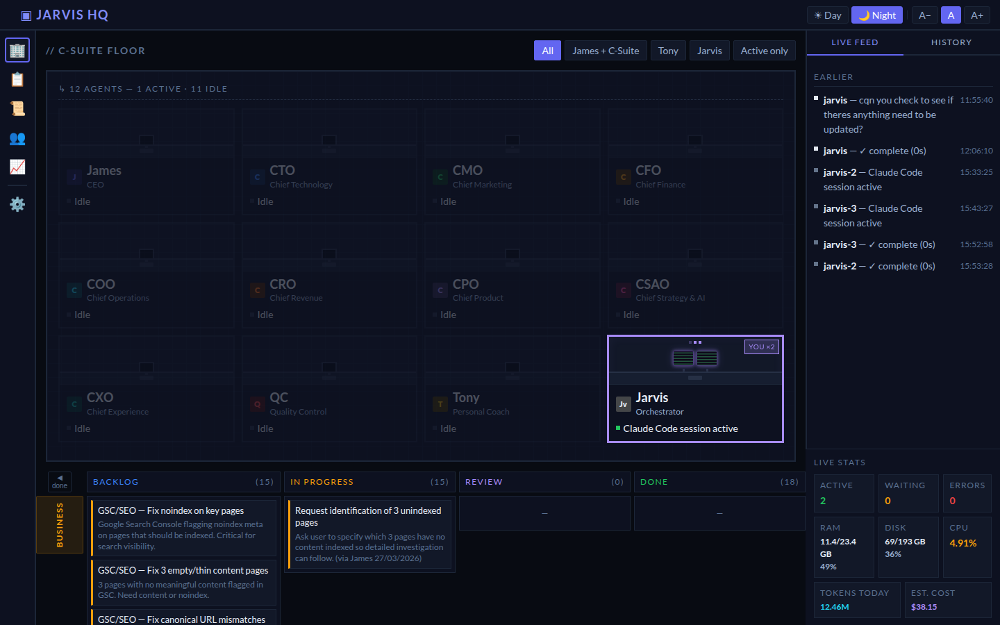

# Agent HQ Dashboard

A real-time monitoring dashboard for a fleet of Claude AI agents. Watch your agents work, track token usage, browse job queues, and manage your task backlog — all from one clean interface.



## What It Is

Agent HQ is a self-hosted web dashboard + Express API server that:

- **Shows live agent status** — which agents are idle, working, or in error state
- **Streams real-time events** via Server-Sent Events (SSE) — no polling, instant updates
- **Tracks token usage and cost** — scans Claude Code session JSONL files daily
- **Parses your TASKS.md** into a Kanban board (Backlog / In Progress / Review / Done)
- **Monitors BullMQ job queues** — if you use Redis-backed queues, you get a full Bull Board UI
- **Stores daily stats** in PostgreSQL for trend graphs (optional)

It's designed to be the "mission control" screen for a multi-agent system built on Claude Code.

---

## Architecture

```
┌─────────────────────────────────────────────────────┐
│                   Browser (React SPA)                │
│  AgentsView │ KanbanBoard │ LiveFeed │ StatsStrip    │
└──────────────────────┬──────────────────────────────┘
                       │ SSE /api/events/hq
                       │ REST /api/stats, /api/tasks, /api/trends
                       ▼
┌─────────────────────────────────────────────────────┐
│              Express Server (src/server.ts)          │
│  agentRegistry  │  tasksParser  │  statsCollector    │
└──────┬─────────────────────────────────┬────────────┘
       │ Redis pub/sub                   │ pg
       ▼                                 ▼
┌─────────────┐                  ┌──────────────┐
│    Redis    │                  │  PostgreSQL  │
│  (BullMQ)  │                  │  (trends)    │
└─────────────┘                  └──────────────┘
       ▲
       │ publishAgentEvent()
┌─────────────┐
│ Your agents │  (any process — Claude Code, worker scripts, etc.)
└─────────────┘
```

**Key design principle:** Agents don't talk to the dashboard directly. They publish events to Redis (or call `emitAgentEvent` in-process), and the dashboard subscribes. This keeps agents fully decoupled from the UI.

---

## Quick Start

### 1. Prerequisites

- Node.js 20+
- Redis (optional — needed for BullMQ queue monitoring)
- PostgreSQL (optional — needed for trend graphs)

### 2. Install

```bash
git clone https://github.com/xonline/agent-hq.git
cd agent-hq
npm install
```

### 3. Configure

```bash
cp .env.example .env
# Edit .env with your values
```

Minimum config to get the dashboard running:

```env
SERVER_PORT=3100
TASKS_FILE=/path/to/your/TASKS.md
CLAUDE_PROJECTS_DIR=/home/youruser/.claude/projects
```

Redis and PostgreSQL are both optional — the dashboard works without them (queue monitoring and trend history will be disabled).

### 4. Build and run

```bash
# Development (hot reload)
npm run dev

# Production
npm run build
npm start
```

### 5. Open the dashboard

Navigate to `http://localhost:3100`

On first visit you'll be prompted to set a password. This is stored as a SHA-256 hash in `data/hq-auth.json`.

---

## Wiring Up Your Agents

### Option A: In-process (same Node.js process)

If your agents run in the same process as the server, import `emitAgentEvent` directly:

```typescript
import { emitAgentEvent } from './lib/agentRegistry.js';

// Mark agent as working
emitAgentEvent('my-agent', 'working', { task: 'Processing customer #42' });

// Mark agent as idle when done
emitAgentEvent('my-agent', 'idle');

// Mark agent as error
emitAgentEvent('my-agent', 'error', { error: 'API timeout' });
```

### Option B: Cross-process via Redis pub/sub

If your agents are separate processes (e.g. Claude Code sessions, Python scripts, worker containers), use Redis:

```typescript
import { publishAgentEvent } from './lib/agentEventBus.js';

// Publish from any process — the server subscribes automatically
await publishAgentEvent('my-agent', 'working', { task: 'Running analysis' });
await publishAgentEvent('my-agent', 'idle');
```

See `src/agents/example-agent.ts` for a full working example.

### Option C: HTTP endpoint (no shared code)

You can also call the REST API directly from any language:

```bash
# Not implemented yet — see Extending section below
```

---

## Customising the Agent Roster

The dashboard shows a pre-defined list of agents. Edit `src/frontend/types/hq.ts` to match your own team:

```typescript
export const AGENT_ROSTER: AgentInfo[] = [
  { id: 'researcher',  label: 'Researcher',  icon: '🔍', description: 'Web research and summarisation' },
  { id: 'writer',      label: 'Writer',      icon: '✍️',  description: 'Content creation' },
  { id: 'analyst',     label: 'Analyst',     icon: '📊', description: 'Data analysis' },
  { id: 'deployer',    label: 'Deployer',    icon: '🚀', description: 'CI/CD and deployments' },
  // Add as many as you need
];
```

Each `id` must match the string you pass to `emitAgentEvent(id, ...)`.

---

## TASKS.md Kanban Format

The Kanban view parses a Markdown file using these markers:

```markdown
## My Project

- [ ] **Task name** — description (backlog)
- [~] **Task name** — description (in progress)
- [?] **Task name** — blocked, waiting for input (review column)
- [x] **Task name** — description (done)
```

Set the path in `.env`:

```env
TASKS_FILE=/home/youruser/projects/my-project/TASKS.md
```

---

## Token Usage Tracking

Agent HQ scans Claude Code's JSONL session files to compute daily token usage and cost:

```env
CLAUDE_PROJECTS_DIR=/home/youruser/.claude/projects
INPUT_PRICE_PER_TOKEN=0.000003   # $3 per million input tokens
OUTPUT_PRICE_PER_TOKEN=0.000015  # $15 per million output tokens
```

Pricing defaults match `claude-3-5-sonnet`. Adjust to match your model:

| Model | Input | Output |
|-------|-------|--------|
| claude-opus-4 | $15/M | $75/M |
| claude-sonnet-4 | $3/M | $15/M |
| claude-haiku-3-5 | $0.80/M | $4/M |

---

## BullMQ Queue Monitoring

If you use BullMQ for job queues, add your queues to `src/server.ts`:

```typescript
import { Queue } from 'bullmq';
import { createBullBoard } from '@bull-board/api';
import { BullMQAdapter } from '@bull-board/api/bullMQAdapter.js';
import { ExpressAdapter } from '@bull-board/express';

const myQueue = new Queue('my-queue', { connection: redis });

const serverAdapter = new ExpressAdapter();
createBullBoard({
  queues: [new BullMQAdapter(myQueue)],
  serverAdapter,
});
serverAdapter.setBasePath('/admin/queues');
app.use('/admin/queues', serverAdapter.getRouter());
```

Then visit `http://localhost:3100/admin/queues` for the full Bull Board UI.

---

## Database Setup (PostgreSQL — optional)

If `TRENDS_DB_URL` is set, Agent HQ auto-creates the required tables on startup:

```sql
-- Created automatically — no manual migration needed
CREATE TABLE daily_stats (
  date DATE PRIMARY KEY,
  input_tokens BIGINT DEFAULT 0,
  output_tokens BIGINT DEFAULT 0,
  total_cost_usd NUMERIC(10,4) DEFAULT 0,
  session_count INT DEFAULT 0,
  updated_at TIMESTAMP DEFAULT NOW()
);

CREATE TABLE hq_events (
  id SERIAL PRIMARY KEY,
  agent_id TEXT NOT NULL,
  event_type TEXT NOT NULL,
  payload JSONB,
  created_at TIMESTAMP DEFAULT NOW()
);
```

---

## Deploying

### systemd (Linux)

```ini
# /etc/systemd/system/agent-hq.service
[Unit]
Description=Agent HQ Dashboard
After=network.target

[Service]
Type=simple
User=youruser
WorkingDirectory=/home/youruser/agent-hq
EnvironmentFile=/home/youruser/agent-hq/.env
ExecStart=/usr/bin/node dist/server.js
Restart=always
RestartSec=5

[Install]
WantedBy=multi-user.target
```

```bash
sudo systemctl enable --now agent-hq
```

### Docker

```dockerfile
FROM node:20-alpine
WORKDIR /app
COPY package*.json ./
RUN npm ci --production
COPY dist/ ./dist/
COPY src/frontend/dist/ ./src/frontend/dist/
EXPOSE 3100
CMD ["node", "dist/server.js"]
```

### Nginx reverse proxy

```nginx
location / {
    proxy_pass http://localhost:3100;
    proxy_http_version 1.1;

    # Required for SSE (Server-Sent Events)
    proxy_set_header Connection '';
    proxy_buffering off;
    proxy_cache off;
    chunked_transfer_encoding on;
}
```

The `proxy_buffering off` line is critical — without it, SSE events will be buffered and the live feed won't work.

---

## Extending

### Adding a REST endpoint

Edit `src/server.ts` — all endpoints follow the same Express pattern:

```typescript
app.get('/api/my-endpoint', requireAuth, async (req, res) => {
  res.json({ data: 'your data here' });
});
```

### Adding a new dashboard view

1. Create `src/frontend/components/MyView.tsx`
2. Add it to `src/frontend/App.tsx` navigation

### Using this with a Claude agent (telling Claude to wire it up)

Paste this into your Claude conversation:

> I have Agent HQ running at http://localhost:3100. It exposes `src/lib/agentRegistry.ts` with `emitAgentEvent(agentId, status, payload?)` and `src/lib/agentEventBus.ts` with `publishAgentEvent(agentId, status, payload?)` for cross-process events via Redis.
>
> Please wire up [your agent] to emit events:
> - `emitAgentEvent('your-agent-id', 'working', { task: '...' })` when starting a task
> - `emitAgentEvent('your-agent-id', 'idle')` when done
> - `emitAgentEvent('your-agent-id', 'error', { error: '...' })` on failure
>
> Also add the agent to `src/frontend/types/hq.ts` AGENT_ROSTER array.

---

## Project Structure

```
agent-hq/
├── src/
│   ├── server.ts              # Express server — SSE, REST APIs, auth
│   ├── lib/
│   │   ├── agentRegistry.ts   # Agent state store + SSE broadcast hub
│   │   ├── agentEventBus.ts   # Redis pub/sub bridge for cross-process events
│   │   ├── queue.ts           # BullMQ queue definitions (extend for your queues)
│   │   ├── redis.ts           # Redis connection config
│   │   ├── tasksParser.ts     # TASKS.md → Kanban board parser
│   │   └── guards.ts          # Zod validators for event payloads
│   ├── agents/
│   │   └── example-agent.ts   # Example: how to emit events from your agent
│   └── frontend/
│       ├── App.tsx            # Main React app + routing
│       ├── components/        # Dashboard UI components
│       ├── hooks/             # useHQStream (SSE), useAgents, useTasks, etc.
│       ├── lib/
│       │   └── auth.ts        # Token auth via localStorage
│       ├── types/
│       │   └── hq.ts          # AGENT_ROSTER + shared TypeScript types
│       ├── styles/            # CSS
│       ├── index.tsx          # React entry point
│       └── vite.config.ts     # Frontend build config
├── data/                      # Runtime data (gitignored)
│   └── hq-auth.json           # Hashed dashboard password (auto-created)
├── .env.example               # All configurable env vars with docs
├── tsconfig.json
└── package.json
```

---

## Tech Stack

| Layer | Tech |
|-------|------|
| Backend | Node.js, Express, TypeScript |
| Real-time | Server-Sent Events (SSE) |
| Frontend | React 18, Vite |
| Job queues | BullMQ + Redis (optional) |
| Database | PostgreSQL (optional) |
| Auth | SHA-256 password hash, localStorage token |

---

## License

MIT
